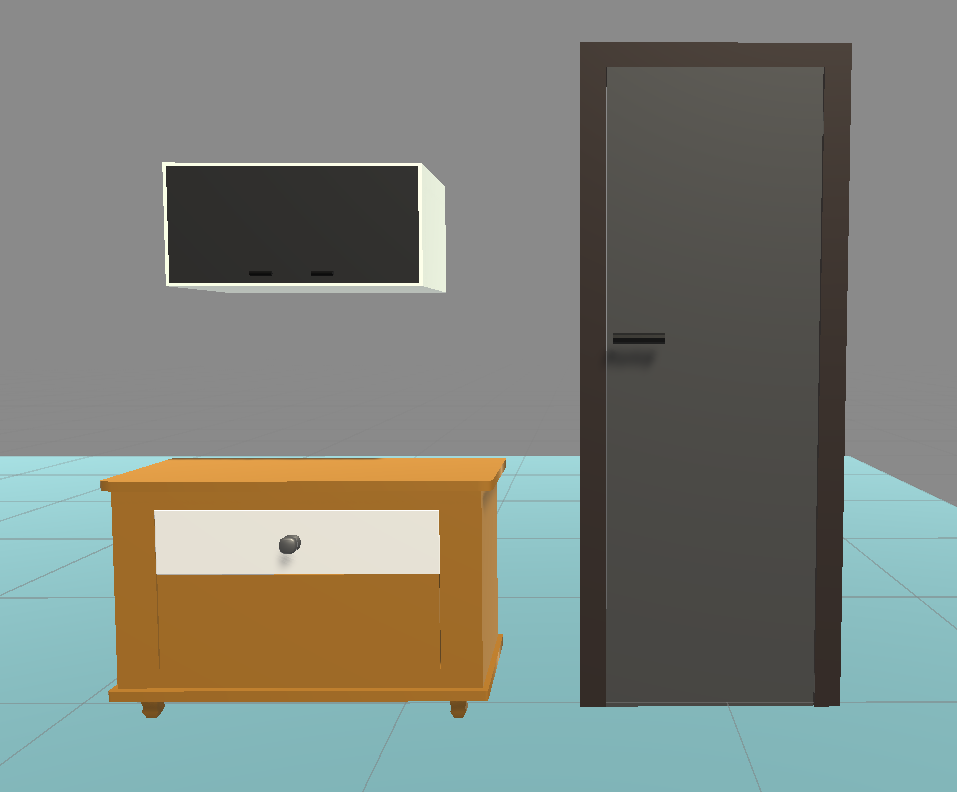

# Реалистичная механика открывания дверей и ящиков | Best Way to Open Door or Drawer into VR

В этой статье, используя различные Joint’s мы реализуем физическое взаимодействие с дверьми и ящиками и прочими подобными объектами в VR.

Краткую информацию об этом вы можете получить в следующем ролике:

🔗 https://youtu.be/T5LZJFg9vWM
альтернативная ссылка:
🔗 https://plvideo.ru/watch?v=Rxkp35LYCmWR

В статье некоторые моменты будут затронуты чуть более глубоко.

# Шаг 1. Подготовка моделей

У меня есть 3 модели, которые я создал в Blender - это дверь, кухонный шкаф и комод.



*Модели с которыми будем работать*

Перед экспортом модели в FBX мы должны убедиться, что у всех объектов сброшен Rotation и Scale, а также, чтобы в дальнейшем упростить работу с Joint, мы должны установить Origin (точка, относительно которой происходят все трансформации) в нужное положение.


*Показано, что такое Origin*

Дверь состоит из двух объектов - дверной косяк и сама дверь, объединенная с петлями и ручкой.

В данном случае точка Origin двери (она же Pivot в Unity) должна находиться на одной из петель. Чтобы ее переместить необходимо в Edit Mode выделить грань петли, ближающайшую к дверному косяку, нажать  **Shift+S** и выбрать пункт **Cursor to Selected**, таким образом 3D-курсор переместится к центру этой грани. В Object Mode нажимаем ПКМ и выбирем пункт **Set Origin → Origin to 3D Cursor**.


*Переместили 3D-курсор и устанавливаем туда Origin*

У кухонного шкафа есть основание и две дверцы, соответственно у дверц точка Origin должна находиться как на картинке (здесь нет петель, потому что я схалтурил, в идеале они должны быть, иначе при открытии двери она будет врезаться в основание).


*Кухонный шкаф*

У ящика комода Origin лучше поместить к передней или задней стенке, в моем случае Origin находится по центру передней стенки.


*Origin ящика находится в передней части*

Готовые модели импортируем в Unity.

# Шаг 2. Настраиваем дверь

Разберемся сначала с дверью, поскольку ручка у нас объединена с дверью, то на нее нужно накинуть коллайдер, также можно накинуть коллайдеры на дверной косяк (Mesh или несколько Box), а также на саму дверь, вот так они будут выглядеть:


Обратите внимание, что коллайдер двери располагается не по всей площади, поскольку при полном открытии двери он будет сталкиваться с дверным косяком и они будут отталкиваться, в идеале, модель нужно проектировать так, чтобы этого не происходило.

Я уже говорил в видео, что если у двери есть коллайдеры и мы, взяв ее в руку начнем далеко отходить, то возникнет неприятный эффект, можете посмотреть по этому таймкоду - (видео с таймкодом)

Поэтому сразу же напишем скрипт, который это исправляет, назовем его HandleGrabInteractable, вот его содержимое:

```jsx
using System.Collections;
using System.Collections.Generic;
using Unity.XR.CoreUtils;
using UnityEngine;
using UnityEngine.XR.Interaction.Toolkit;

public class HandleXRGrabInteractable : XRGrabInteractable
{
    // переопределяем метод, срабатывающий при захвате объекта
    protected override void OnSelectEntered(SelectEnterEventArgs args)
    {
        base.OnSelectEntered(args);
        // вызываем корутину, которой передаем Transform руки (interactorObject - это объект который начал взаимодействие с нашим GrabInteractable, это может быть Direct Interactor, или, например, Ray Interactor)
        StartCoroutine(CancleGrabWhenHandMove(args.interactorObject.transform.parent));
    }

    private IEnumerator CancleGrabWhenHandMove(Transform handTransform)
    {
        while (true)
        {
            // вычисляем дистанцию между ручкой и рукой
            Vector3 distance = this.transform.position - handTransform.position;
						// если рука отклонилась на 0.3 метра в любую из сторон
            if (distance.magnitude > 0.3f)
            {
                // включаем и отключаем скрипт, таким образом рука оторвется от ручки
                this.enabled = false;
                this.enabled = true;
                yield break;
            }
            yield return null;
        }
    }
}
```

Все пояснения я написал в комментариях. 

P.S. я не нашел более элегантного решения для отцепления руки от ручки, кроме как отключать скрипт, у XR Grab Interactable нет такого метода, который бы отсоединял нас от интерактора.
Если вы знаете более правильное решение, напишите мне об этом, контакты есть внизу статьи, буду благодарен ❤️.

Накидываем скрипт на ручку двери и делаем следующие настройки:

- в Movement Type ставим Velocity Tracking;
- отключаем Track Rotation, Track Scale и Throw On Detach, поскольку они в данном случае не нужны.

Также накидываем Fixed Joint, чтобы вдальнейшем привязать коллайдер ручки к двери.


*Все компоненты ручки двери*

Теперь нам нужно настроить саму дверь. Накидываем на нее Hinge Joint, с помощью которого будем ограничивать вращение двери. Делаем следующие настройки:

- меняем оси так (Axis), чтобы ось вращения стала горизонатальной
(картинка);
- ставим галочку Use Limits и ограничиваем вращение до 100 градусов;
- также советую включить галочку Use Spring и поставить 5 в Damper.

P.S. Damper регулирует замедление объекта после физического взаимодействия, например, если мы возьмемся за ручку двери и потом ее резко бросим вперед, то при Damping=0 дверь улетит вперед, а при Damping=5 быстро замедлится, поиграйте с этой настройкой и поставьте как вам больше нравится.


*Настройки Hinge Joint для двери, изменения помечены галочкой*

Осталось только перенести Rigidbody двери в Fixed Joint ручки.


*Перенесли Rigidbody двери в Fixed Joint (Connected Body) ручки*

# Шаг 3. Кухонный шкаф

Кратко опишу процесс настройки дверей кухонного шкафа:

- накидываем коллайдеры на шкаф, двери и ручки;
- на обе ручки накидываем Fixed Joint и Handle XR Grab Interactable, настраиваем следующим образом:
    - в Movement Type ставим Velocity Tracking;
    - отключаем Track Rotation, Track Scale и Throw On Detach;
- на обе двери накидываем Hinge Joint и настраиваем, как на картинке ниже;
- переносим Rigidbody двери в Fixed Joint ручки.


*Hinge Joint левой двери*


*Hinge Joint правой двери*

Поскольку у данной модели нет петель, необходимо аккуратно располагать коллайдеры, так, чтобы они никогда не могли войти друг в друга.


*Коллайдеры кухонного шкафа*

# Шаг 4. Комод

Теперь перейдем к комоду:

- накидываем коллайдеры на комод, выдвижной ящик и ручку, здесь нужно быть предельно аккуратными, коллайдеры не должны касаться друг друга;
- на ручку накидываем Fixed Joint и Handle XR Grab Interactable, настраиваем следующим образом:
    - в Movement Type ставим Velocity Tracking;
    - ставим галочку Use Dynamic Attach, без этого ящик будет магнититься к руке, что будет создавать неприятный эффект;
    - y Use Dynamic Attach убираем галочку Match Rotation;
    - отключаем Track Rotation, Track Scale и Throw On Detach.

Для ящика комода будем использовать Configurable Joint со следующими настройками:

- блокируем вращение по всем осям - Angular X Motion, Angular Y Motion и Angular Z Motion устанавливаем параметр Locked;
- выбираем локальные координаты и смотрим по какой оси будет двигаться комод, для этой оси ставим параметр Limited (в моем случае Y Motion), а другие оси блокируем (Locked);
- В Linear Limit необходимо указать, на сколько максимум мы можем выдвинуть ящик, чтобы вычислить это значение можем к нужной оси прибавлять примерное значение, обратите внимание, что здесь используются глобальные координаты. В моем случае, получилось 0.35;
- Damping здесь устанавливается для конкретной оси, в моем случае это Y Drive, Position Damper = 20.

Переносим Rigidbody ящика в Fixed Joint ручки.


*Коллайдеры ящика комода*


*Настройки Configurable Joint ящика комода*

# Бонус. Озвучка при движении ящика/двери

Если вы хотите сделать так, чтобы при открывании дверей или ящика комода был соответствующий звук, то нужно написать небольшой скрипт.

```csharp
using System.Collections;
using System.Collections.Generic;
using UnityEngine;

[RequireComponent(typeof(AudioSource))]
public class OpeningSound : MonoBehaviour
{
    [SerializeField] private Rigidbody _rb;
    [SerializeField] private AudioSource _audioSource;

    private void Awake()
    {
        _rb = GetComponent<Rigidbody>();
        _audioSource = GetComponent<AudioSource>();
    }

    public void CheckOpeningProcess()
    {
        StartCoroutine(OpeningSoundCoroutine());
    }

    public IEnumerator OpeningSoundCoroutine()
    {
        while (true)
        {
            // если длина вектора скорости > 0.5 т.е. объект движется
            if (_rb.velocity.magnitude > 0.5f)
            {
                _audioSource.Play();
                yield return new WaitForSeconds(_audioSource.clip.length);
            }
            
            yield return null;
        }
    }
}

```

Кидаем скрипт на ручку, а также не забудьте накинуть соответствующий звук. Чтобы скрипт заработал, необходимо вызывать корутину при захвате объекта - First Select Entered и останавливать все корутины при отпускании объекта Select Exited


*События First Select Entered и Select Exited у Handle XR Grab Interactable*

# Контакты

Если у вас есть какие-либо замечания или полезные дополнения к статье, можете написать мне в VK.

VK - [https://vk.com/zabelyaevroman](https://vk.com/zabelyaevroman)

Youtube - [https://www.youtube.com/@vrfordev](https://www.youtube.com/@vrfordev)
