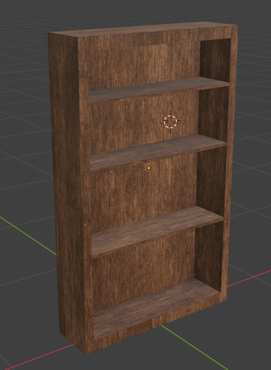
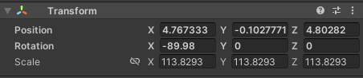
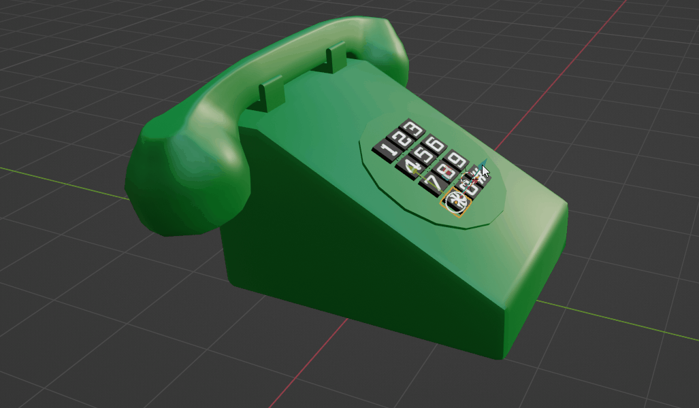
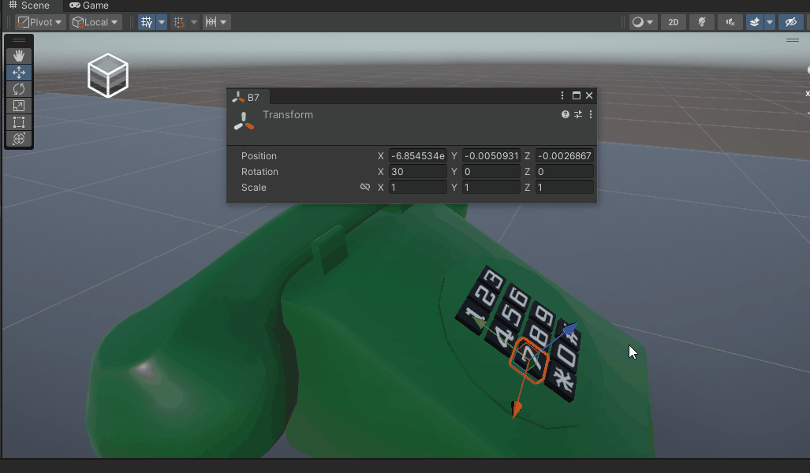
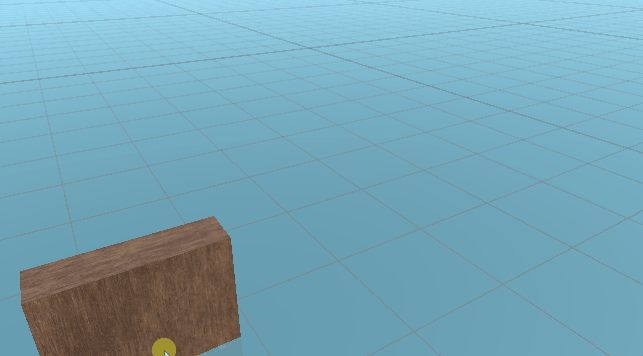
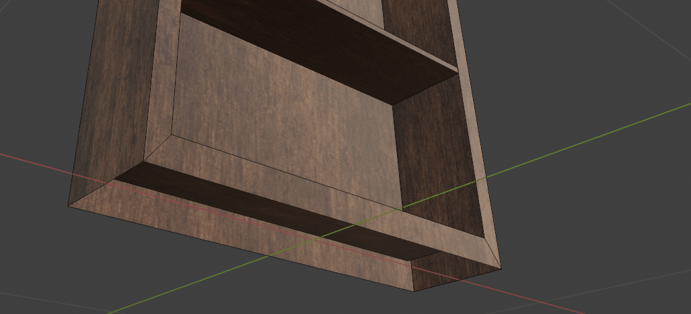
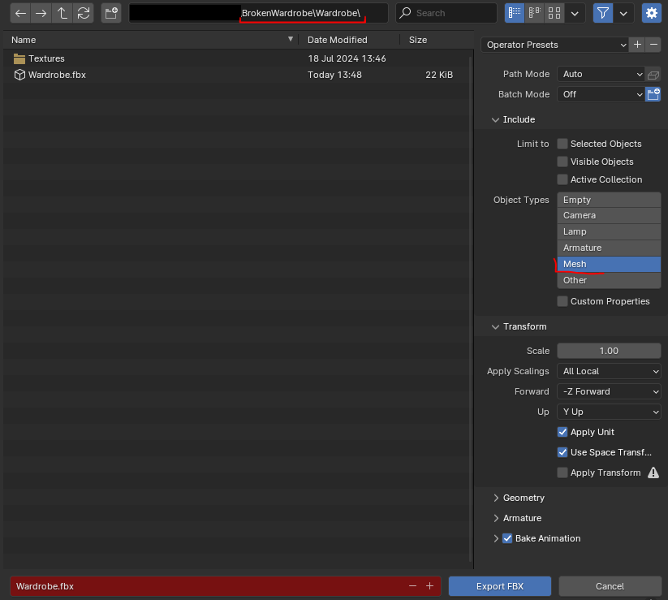
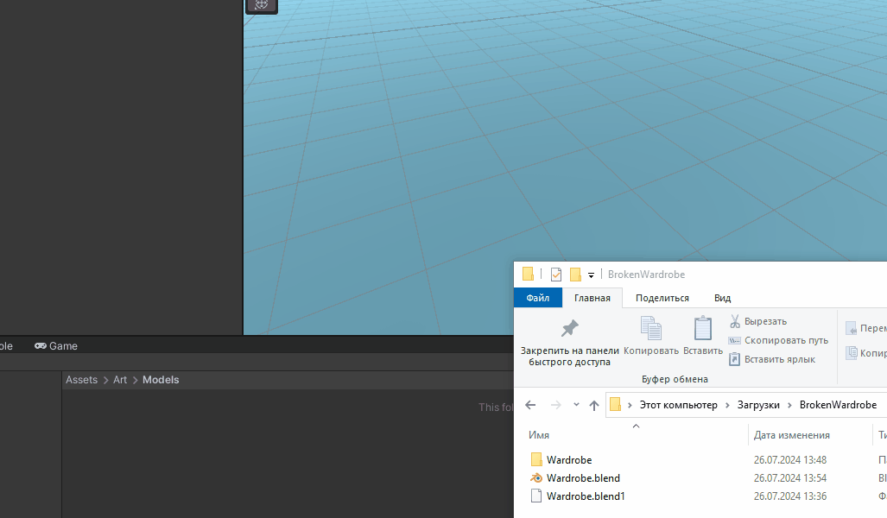
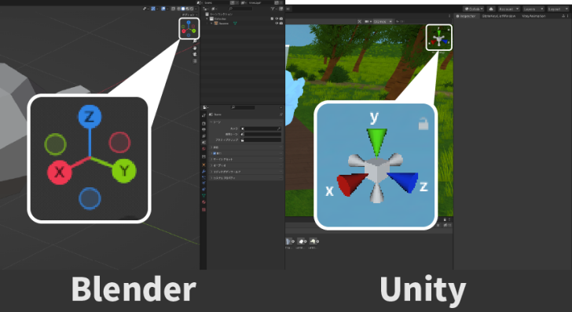

# Правильный экспорт моделей (мешей) из Blender в Unity

В этой статье мы разберем, как правильно экспортировать меши из Blender в Unity, без анимаций.

Если хотите посмотреть ролик, то вот ссылки:

🔗 https://youtu.be/mssljUMWesA
альтернативная ссылка:
🔗 https://plvideo.ru/watch?v=S6AwNlI-I6_E

У меня есть шкаф, у которого есть **PBR** текстуры, если хотите повторять вместе со мной, по ссылочке можете скачать эту модель с текстурами - [https://disk.yandex.ru/d/SyxlguLXWLFO5w](https://disk.yandex.ru/d/SyxlguLXWLFO5w).

Перед тем как его экспортировать обязательно проверяем нормали, в меню **Overlays** выбираем **Face Orientation**, красным помечены вывернутые нормали, в **Unity** вывернутые нормали будут отображать полигоны как невидимые.

*Модель с вывернутыми нормалями в Blender*

*Вывернутые нормали в Unity*

Нам это не нужно, поэтому заходим в **Edit Mode**, выделяем всю модель, нажимаем **Alt+N** и выбираем пункт **Recalculate Outside (Shift+N)**, если это не помогло, то мы можем вручную выделять полигоны и с помощью **Alt+N → Flip**, менять их направление. 

*Выворчаиваем нормали с помощью Recalculate Outside*

Теперь необходимо сбросить **Rotation** и **Scale**, в **Object Mode** нажимаем **Ctrl+A** и выбираем пункт **Rotation and Scale**, таким образом в N-панели, **Scale** должен стать единицей, а **Rotation** нулем. В **Dimensions** вы можете видеть, что размеры шкафа соответствуют размерам из реального мира.

*Transform объекта после сброса Rotation и Scale*

Если мы не сбросим Scale и Rotation то эти параметры в Unity примут некорректные значения, Scale необходимо сбрасывать всегда, по крайней мере у меня еще не было такого случая, когда это не следовало бы делать. 

*Некорректный scale и rotation в Unity*

А вот с Rotation нужны быть осторожнее, у меня есть модель телефона (гифка ниже) и здесь у меня есть кнопки, на которые я хотел бы нажимать, сейчас они повернуты на 30 градусов. 

*Телефон с физическими кнопками*

*Каждая кнопка повернута на 30 градусов*

Если я сброшу Rotation у всех кнопок и переброшу FBX модель в Unity, то вы увидите, что их локальные оси направлены не так, как мне бы хотелось.

Но если не сбрасывать Rotation, то все в порядке.

Теперь проверяем, где находится точка **Origin**, сейчас она в середине шкафа и если я ее там оставлю, то когда я буду ставить шкаф на пол, он будет магнититься к полу как раз этой точкой, в случае шкафа точка **Origin** (она же  **Pivot** в Unity) должна быть снизу шкафа.

*Неверно установлена точка Origin*

Для того, чтобы это исправить, выделяем два ребра в нижней части шкафа (*гифка ниже*), нажимаем **Shift+S** и выбираем пункт **Cursor To Selected**, возвращаемся в **Object Mode**, нажимаем правой клавишей мыши, находим пункт **Set Origin** и выбираем **Origin to 3D Cursor**.

*Изменяем точку Origin*

Теперь нажимаем **File→Export→FBX** и в данном случае я хочу экспортировать только **Mesh**, его и выбираю, а несколько типов можно выбирать с зажатой клавишей **Shift**.

*Настройки экспорта модели в FBX*

Обратите внимание куда я сохраняю модель, в той папке, где у меня находится **Blender** файл я всегда создаю папку с названием модели и там храню текстуры, в папке **Textures**, а также готовый **FBX** файл, это сделано для того, чтобы было удобно переносить модель в **Unity**, ведь для этого достаточно перетащить эту папку с **FBX** и текстурами.

Пробуем экспортировать, открываем проект в **Unity** и переносим нашу папку с моделью, текстуры при этом автоматически подцепляются.

*Импортируем шкаф в Unity*

При таком подходе у нас есть несколько проблем, во-первых, у шкафа стоит неадекватный **Rotation** по **X**, а размер модели составляет 100, 100 и 100. Давайте это исправим.

*Некорректный Rotation и Scale у модели*

При экспорте необходимо поставить галочку **Apply Transform**, тогда вращение и масштабирование будет корректно отображаться в **Unity**. Но **Apply Transform** является экспериментальной функцией и может привести к проблемам, особенно при экспорте костей и анимаций. Поэтому давайте попробуем исправить эти проблемы без использования этой галочки.

*Экспорт модели с Apply Transform исправит размеры и повороты*

Разберемся с вращением, конфликт с вращением возникает из-за того, что **Unity** использует правостороннюю систему координат, а **Blender** левостороннюю, как видите, они имеют разное расположение осей. 

*Отличие координатных осей Blender от Unity*

Чтобы в **Unity** все отображалось корректно, необходимо развернуть модель по **X** на **-90**, применить **Rotation (Ctrt+A→Rotation)**, а затем повернуть модель по **X** на **90** и не применять транформацию. Теперь при экспорте убираем галочку **Apply Transform**, а в **Apply Scaling** выбираем **FBX Units Scale**, это исправит масштаб.

*Итоговые настройки экспорта*

## Заключение

При экспорте мешей без анимаций вы смело можете использовать экспериментальную фишку Blender (**Apply Transform**), а с экспортом костей и анимаций мы разберемся в другой статье.
