# Система ввода в XR Interaction Toolkit 3.0 | How to XRI Input System Works

В этой статье рассматриваются способы работы с системой ввода в XR Interaction Toolkit.

Если хотите посмотреть ролик, то вот ссылки:🔗 https://youtu.be/zwDE4aYnxu4
альтернативная ссылка: 🔗 https://plvideo.ru/watch?v=UxuV9UbjvOtf

Открываем Unity Hub и создаем новый проект, в качестве шаблона будем использовать VR Core.

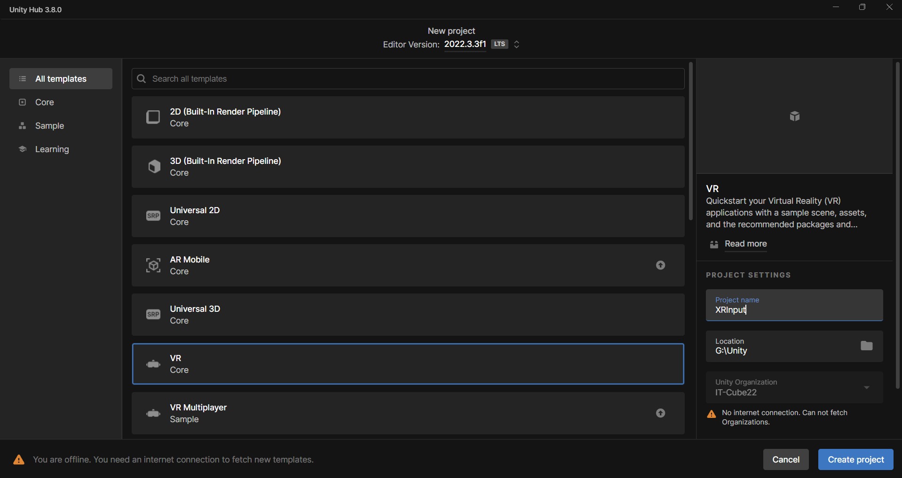

На стандартной сцене у нас есть игрок, представленный как XR Origin, переименуем его в Player для удобства.

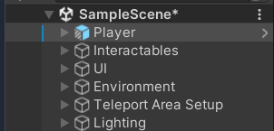

Откроем настройки освещения (*Ctrl+9*), уберем автоматическую запечку и очистим то, что уже запеклось.

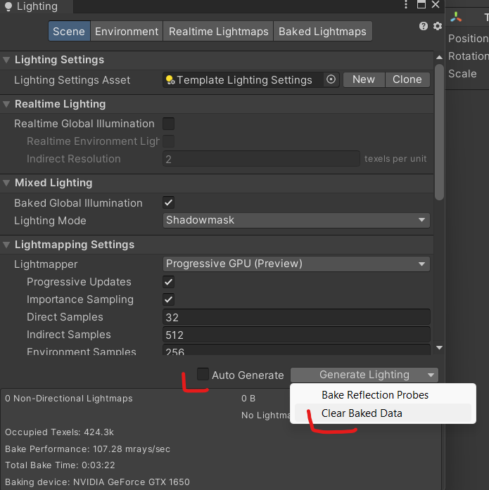

Откроем стандартную папку с сэмплами (**Samples -> XR Interaction Toolkit -> 3.0.3 -> Starter Assets**), и здесь у нас есть **XRI Default Input Actions**, в котором у нас прописаны стандартные действия для обработки кнопок контроллеров. Мы не будем разбирать все действия, наша задача — понять, как их обрабатывать с помощью кода.

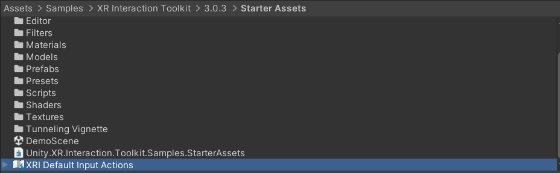

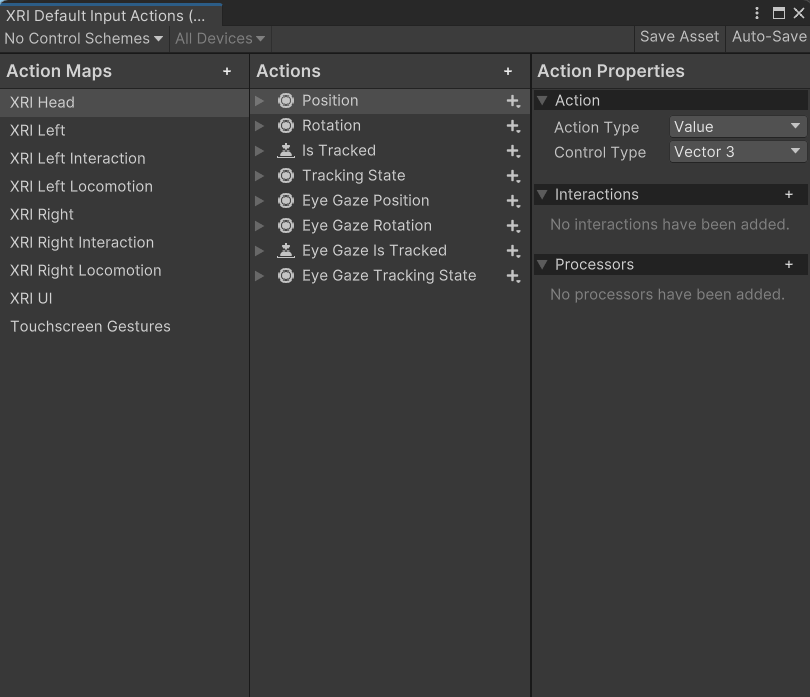

По запросу "**XR Input unity**" можем найти [документацию](https://docs.unity3d.com/Manual/xr_input.html), где расписаны различные инпуты для каждого поддерживаемого устройства.

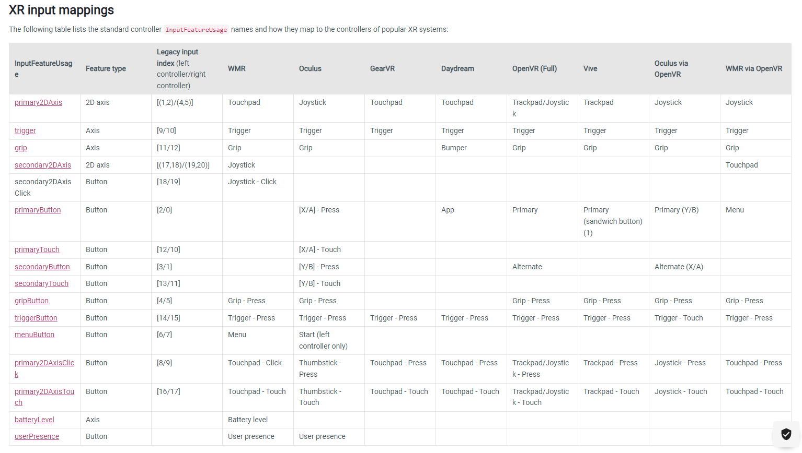

Для примера, давайте создадим **NPC**, у меня есть шлем **Oculus,** и я хочу сделать так, чтобы диалог с **NPC** запускался тогда, когда игрок подходит в триггерную зону и нажимает кнопку **A** на контроллере. Текст с подсказкой, на какую кнопку необходимо нажать будет скрыт, также нам понадобится **AudioSource** для запуска озвучки диалога.

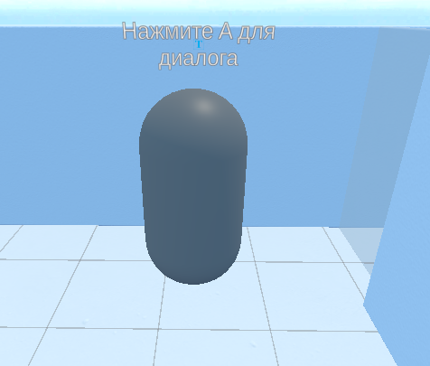

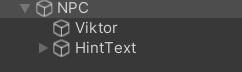

Создадим скрипт **NPC**, накинем его на **NPC** и откроем его в **IDE**.

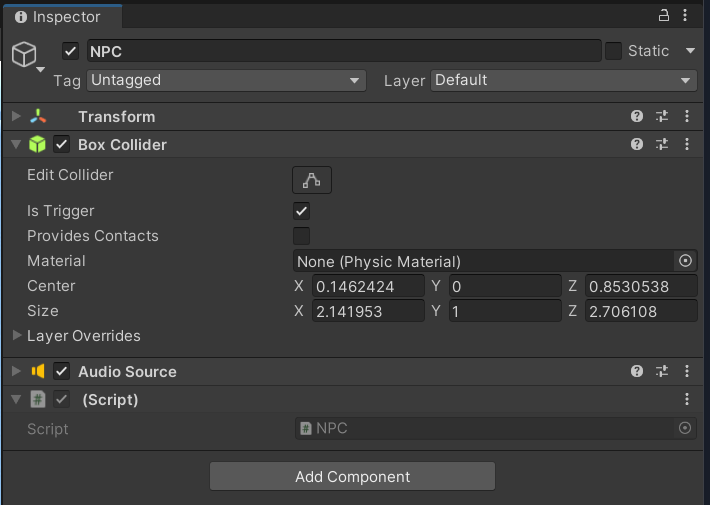

Объявим необходимые объекты и методы:.

```C#
using System.Collections;
using System.Collections.Generic;
using UnityEngine;

public class NPC : MonoBehaviour
{
    [SerializeField] private GameObject _hintText;
    private AudioSource _audioSource;
    

    private void Awake()
    {
        _audioSource = GetComponent<AudioSource>();
    }

    private void OnTriggerEnter(Collider other)
    {
        
    }

    private void OnTriggerExit(Collider other)
    {
        
    }
}
```

По умолчанию в дефолтных **Actions** нигде не прописана реакция на кнопку **A**, ее необходимо прописать самостоятельно. В **Action Map XRI Right Interaction** создадим новый **Action** и назовем его **A Button**.

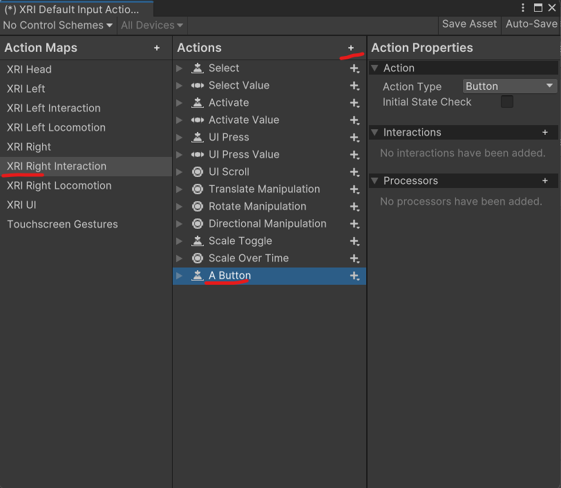

В **Action Type** у нас стоит **Button**, поскольку нам необходимо считывать только нажатие на кнопку. Теперь найдем нужный Binding, для этого можно обратиться к документации, для окулуса, кнопка **A** запрограммирована на **primaryButton**.

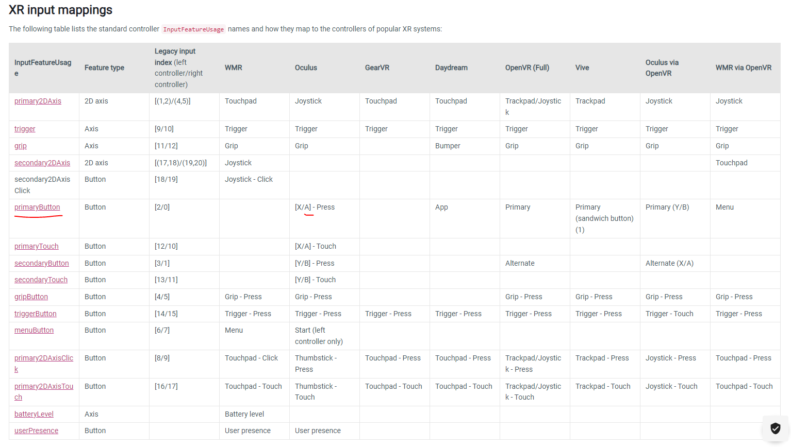

Выбираем **XR Controller -> XR Controller (Right Hand) -> Usages -> PrimaryButton**. Сохраним ассет.

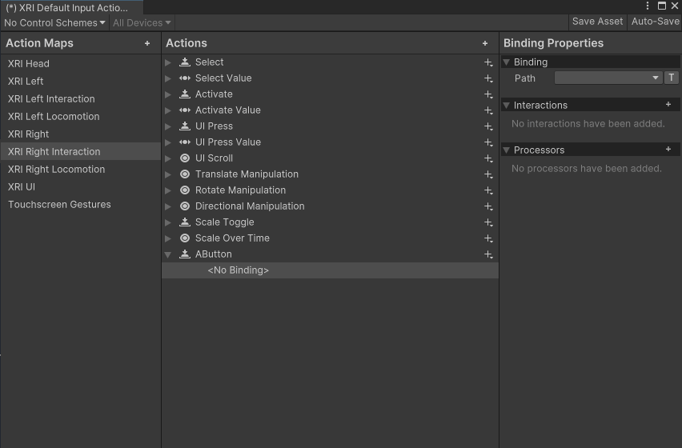

В скрипте мы можем создать сериализуемое поле типа **InputActionProperty**. Не забудьте подключить соответствующий **using**.

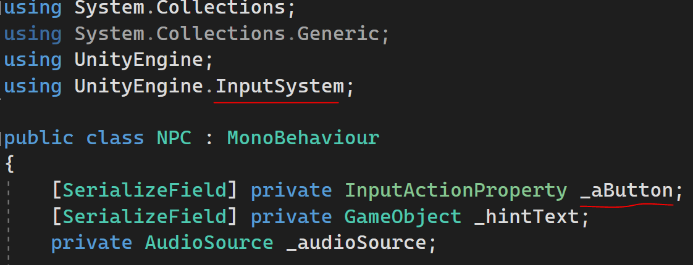

Теперь в **Unity** можем назначить кнопку.

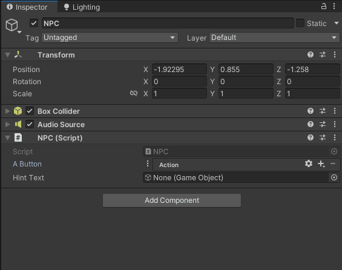

Вернемся к скрипту.

Теперь нам необходимо понять, нажата ли кнопка, это можно сделать несколькими способами, первый способ я никогда не использовал, но, он может быть полезен в тех случаях когда нам нужно отслеживать, зажата ли кнопка, например, в игре **Assassins Creed Nexus** для активации действий необходимо зажимать кнопку.


Давайте создадим корутину, назовем ее **ListenAButtonClick**, в ней запускаем бесконечный цикл **while** и проверяем, нажата ли кнопка, с помощью метода **IsPressed()** у **AButton**, внутри условия будет некая логика, например, мы будем запускать озвучку диалога и скрывать **hintText**. А если звук завершился, то будем показывать **hintText**.

```C#
private IEnumerator ListenAButtonClick()
    {
        while (true)
        {
            if (_aButton.action.IsPressed())
            {
                _audioSource.Play();
                _hintText.SetActive(false);
            }

            if (!_audioSource.isPlaying)
            {
                _hintText.SetActive(true);
            }

            yield return null;
        }
    }
```

Единственный нюанс заключается в том, что звук будет перезапускаться при каждом нажатии на кнопку, чтобы это исправить создадим логическую переменную **_canSpeak**, изначально она **true** и диалог будем запускать если нажата кнопка и можно говорить.

```C#
bool _canSpeak = true;
private IEnumerator ListenAButtonClick()
    {
        while (true)
        {
            if (_aButton.action.IsPressed() && _canSpeak)
            {
                _canSpeak = false;
                _audioSource.Play();
                _hintText.SetActive(false);
            }

            if (!_audioSource.isPlaying)
            {
                _canSpeak = true;
                _hintText.SetActive(true);
            }

            yield return null;
        }
    }
```

Запустим корутину в **OnTriggerEnter()** и остановим в **OnTriggerExit()**.

```C#
    private void OnTriggerEnter(Collider other)
    {
        _hintText.SetActive(true);      
        StartCoroutine(ListenAButtonClick());
    }
    
    private void OnTriggerExit(Collider other)
    {
        _hintText.SetActive(false);
        StopAllCoroutines();
    }
```

Тестировать будем в симуляции, для этого нам нужно открыть **Package Manager** и в пакетах найти **XR Interaction Toolkit**, на вкладке **Samples** можно импортировать **XR Device Simulator**.

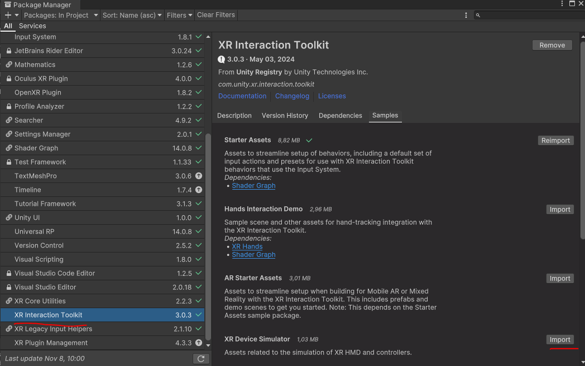

Теперь заходим в **Project Settings** и в пункте **XR Interaction Toolkit** подключаем симулятор.

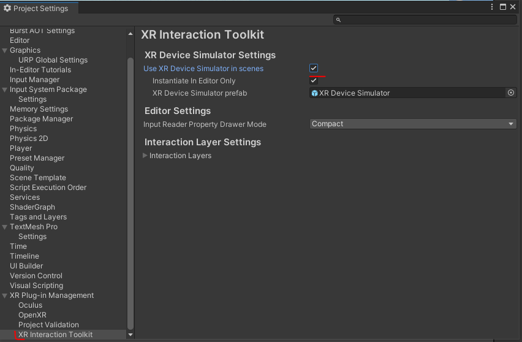

Давайте запустим игру и кратко разберем, как работает симулятор, используя **WASD** подойдем к **NPC**, нажмем **Escape** и вернемся в окно сцены. Если посмотреть на игрока, то можно заметить, что его **Character Controller** совсем не сдвинулся.

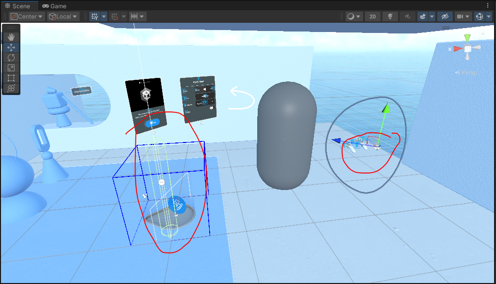

Вернемся в окно **Game**, нажмем **Tab**, чтобы перейти на управление шлемом, и теперь я зажму **Shift** и начну ходить, таким образом **Character Controller** подмагнитится к тому месту, где у меня находятся контролеры.


Теперь, нажимая **Tab** мы должны сделать активной правую руку. На рисунке видно, что клавиша **A** на контроллере - это **B** на клавиатуре, нажимаем **B**, запускается диалог, когда он закончится у нас снова появится текстовая подсказка.

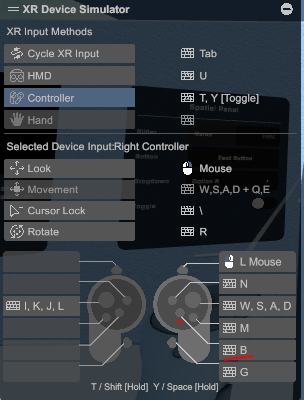

В данном конкретном случае корректнее было бы отслеживать нажатие кнопки через подписку на события. Уберем вызов и отмену корутины в методах **OnTriggerEnter()** и **OnTriggerExit()**, соответственно. У любых кнопок есть поле action у которого есть события: кнопка начала нажиматься (**started**), нажалась (**performed**), начала нажиматься но не до конца была отжата (**canceled**).

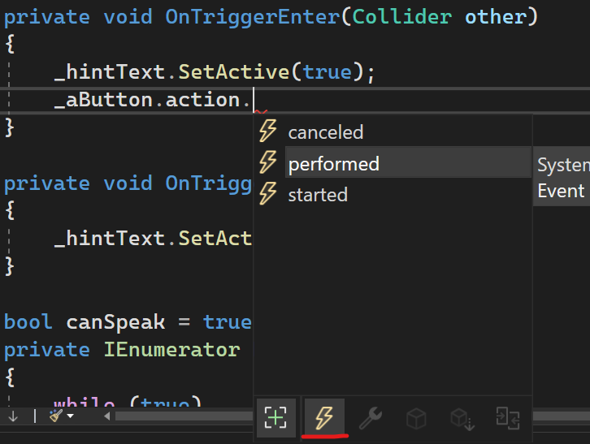

Нас интересует событие **performed**, ставим плюс равно и нажимаем **Tab** для автоматической генерации кода, называем этот метод **AButtonPress**, например.

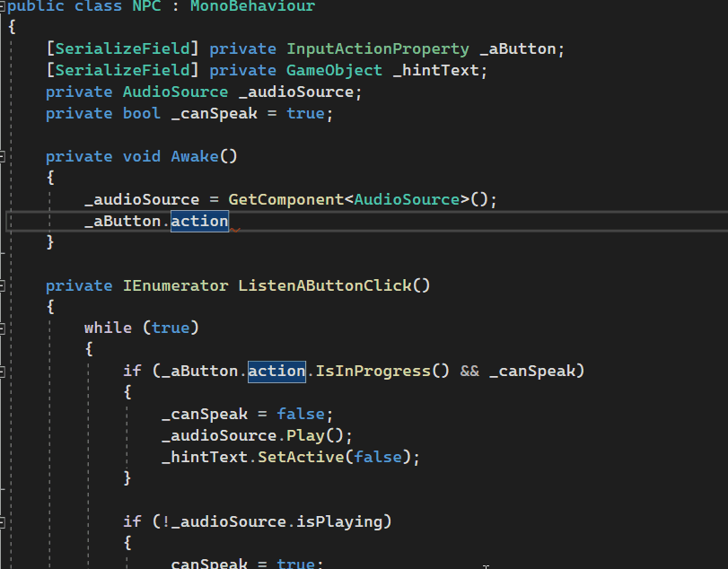

Пропишем небольшую логику в **AButtonPress**:

```C#
    private void AButtonPress(InputAction.CallbackContext obj)
    {
        if (_canSpeak)
        {
            _canSpeak = false;
            _audioSource.Play();
            _hintText.SetActive(false);
        }
    }
```

Создадим новую корутину, которая будет отслеживать, закончился диалог или нет:

```C#
    private IEnumerator DialogueProcess()
    {
        while (true)
        {
            if (!_audioSource.isPlaying)
            {
                _canSpeak = true;
                _hintText.SetActive(true);
                yield return true;
            }
            yield return null;
        }
    }
```

Не забуем ее запустить

```C#
    private void AButtonPress(InputAction.CallbackContext obj)
    {
        if (_canSpeak)
        {
            _canSpeak = false;
            _audioSource.Play();
            _hintText.SetActive(false);

            StartCoroutine(DialogueProcess());
        }
    }
```

Также мы должны отписаться от события performed в **OnTriggerExit()**:

```C#
    private void OnTriggerExit(Collider other)
    {
        _hintText.SetActive(false);
        _aButton.action.performed -= AButtonPress;
    }
```

Весь код скрипта **NPC** сейчас выглядит следующим образом:

```C#
using System.Collections;
using System.Collections.Generic;
using UnityEngine;
using UnityEngine.InputSystem;

public class NPC : MonoBehaviour
{
    [SerializeField] InputActionProperty _aButton;
    [SerializeField] private GameObject _hintText;
    private AudioSource _audioSource;
    private bool _canSpeak = true;


    private void Awake()
    {
        _audioSource = GetComponent<AudioSource>();
    }

    private void OnTriggerEnter(Collider other)
    {
        _hintText.SetActive(true);
        _aButton.action.performed += AButtonPress;
    }

    private void AButtonPress(InputAction.CallbackContext obj)
    {
        if (_canSpeak)
        {
            _canSpeak = false;
            _audioSource.Play();
            _hintText.SetActive(false);

            StartCoroutine(DialogueProcess());
        }
    }

    private IEnumerator DialogueProcess()
    {
        while (true)
        {
            if (!_audioSource.isPlaying)
            {
                _canSpeak = true;
                _hintText.SetActive(true);
                yield return true;
            }
            yield return null;
        }
    }

    private void OnTriggerExit(Collider other)
    {
        _hintText.SetActive(false);
        _aButton.action.performed -= AButtonPress;
    }
}
```

Итак, мы научились отслеживать клик по кнопке, подписываясь на события и используя метод **IsPressed()**.

Теперь представьте, что мы создаем игру, в которой игрок будет представлять из себя мехатрона, и мы бы хотели управлять мехом, используя контроллеры, т.е. нам необходимо знать как считывать значения со стика.

Для примера, в том же скрипте **NPC** уберем всё лишнее и создадим новый **InputActionProperty**, назовем его **_rightStick**. В **Update** у стика будем считывать значения, представленные типом **Vector2**.

```C#
using System.Collections;
using System.Collections.Generic;
using UnityEngine;
using UnityEngine.InputSystem;

public class NPC : MonoBehaviour
{
    [SerializeField] InputActionProperty _rightStick;

    private void Update()
    {
        Debug.Log(_rightStick.action.ReadValue<Vector2>());
    }
}
```

Вернемся в движок и назначим соответствующий **Action**, в нашем случае это будет **Thumbstick** на правой руке.

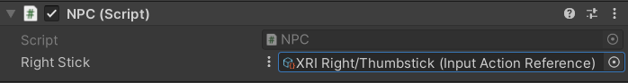

Двойным кликом откроем его и рассмотрим повнимательнее. Он будет возвращать нам некое значение, представленное **Vector 2**, а кнопка контроллера представляет собой **Primary2DAxis**.

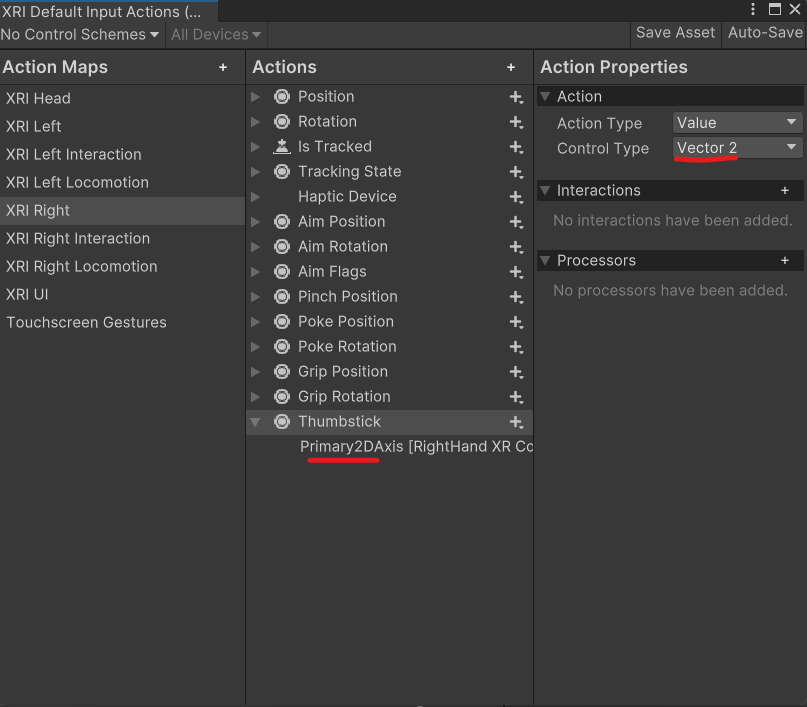

Запустим симуляцию. Выбираем правую руку. В консоли видим, что сейчас у нас по **X** и **Y** нулевые значения. Максимальное отведение стика влево будет -1,0; вправо - 1;0, вверх и вниз, соответственно, 0;1 и 0;-1.

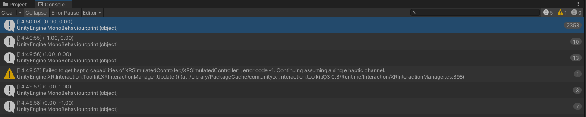

Естественно, в симуляции трудно отловить промежуточные значения, но если игру запустить в шлеме, то мы будем иметь доступ ко всему диапазону значений.

Если вам нужны более специфичные вещи не забывайте обращаться к [документации](https://docs.unity3d.com/Manual/xr_input.html).

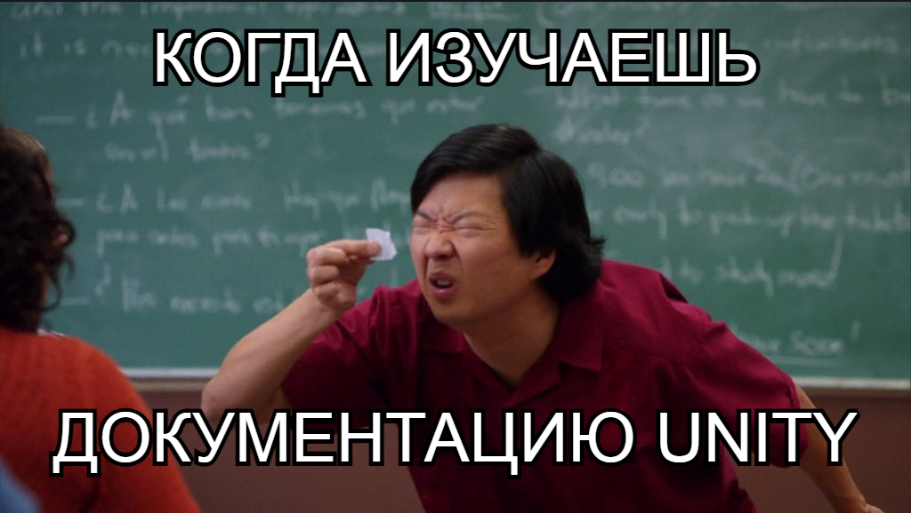


